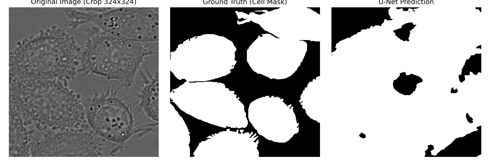

# 01_U-Net: 经典医学图像分割复现 (DIC-C2DH-HeLa)

本项目基于 PyTorch 完整复现了医学图像分割经典论文 **U-Net: Convolutional Networks for Biomedical Image Segmentation** (MICCAI 2015)。

## 1. 数据集介绍
- **数据集**：ISBI Cell Tracking Challenge - `DIC-C2DH-HeLa`
- **特点**：单通道显微镜灰度图像（512x512），稀疏人工标注（共 18 组有效样本）

## 2. 实验设置与改进策略
- **网络架构**：遵循 U-Net 编码-解码结构与跳跃连接，在 DoubleConv 中引入 `BatchNorm2d` 保证深层梯度的顺畅传播。
- **空间对齐**：使用原版无填充卷积（Valid Conv），标签使用 `Center Crop` 裁剪至 324x324 与网络输出严格对齐。
- **损失设计**：针对相邻细胞边缘易粘连的问题，使用 `CrossEntropyLoss + DiceLoss` 组合损失。
- **数据增强**：实现图像与掩膜严格同步的随机水平/垂直翻转及随机小角度微旋。

## 3. 实验结果对比 (Ablation Study)

| 实验配置 | 训练轮数 | Mean IoU | Mean Dice | 表现分析 |
| :--- | :---: | :---: | :---: | :--- |
| Baseline (未增强) | 60 | 93.56% | 96.67% | 存在对特定位置和噪点的过拟合记忆 |
| **+ Data Augmentation (推荐)** | 60 | **86.57%** | **92.42%** | 轮廓更具生物平滑性，具备旋转不变性与更强泛化力 |

*注：原论文 2015 年在未知测试集上的盲测 Mean IoU 为 77.56%。*

## 4. 可视化效果


## 5. 快速复现
```bash
# 1. 训练模型
python train.py

# 2. 模型定量评估
python evaluate.py

# 3. 结果对比可视化
python predict.py