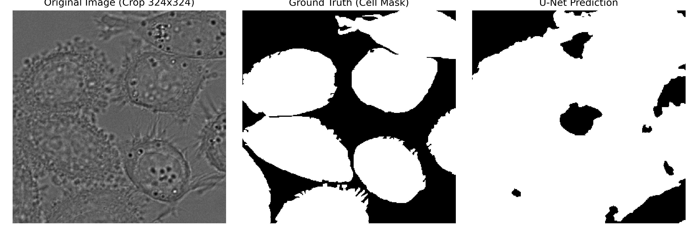

# 01_U-Net: 经典医学图像分割复现 (DIC-C2DH-HeLa)

本项目基于 PyTorch 完整复现了医学图像分割经典论文 **U-Net: Convolutional Networks for Biomedical Image Segmentation** (MICCAI 2015)。

## 1. 数据集介绍
- **数据集**：ISBI Cell Tracking Challenge - `DIC-C2DH-HeLa`
- **特点**：单通道显微镜灰度图像（512x512），稀疏人工标注（共 18 组有效样本）

## 1.5 项目结构
```
01_U-Net/
├── U_net_original.py      # 论文原架构（无 BatchNorm，valid conv）
├── U_net_baseline.py      # 原架构 + BatchNorm（主力模型）
├── U_net_no_skip.py       # 有 BN、去跳跃连接（对照）
├── dataset_unified.py     # 统一数据集：train/val 划分 + instance mask + 弹性变形
├── losses_Dice.py         # CE + Dice 组合损失
├── losses_original.py     # 论文加权 CE（w_c 类别平衡 + 边界距离权重）
├── train_ablation.py      # 统一消融训练脚本（模型/优化器/损失全部参数化）
├── run_ablation.sh        # 一键跑全部消融步骤（step0~step10）
├── evaluate.py            # 统一评估（按实验名自动加载对应架构与 checkpoint）
├── predict.py             # 单张图预测可视化（原图/GT/预测三联图）
├── ABLATION_RESULTS.md    # 消融实验完整结果与分析
├── diagnosis.html         # 诊断报告：旧 Original 模型退化为全前景的证据
└── results/               # 各实验 checkpoint（不入库）与逐 epoch 日志
```

## 2. 实验设置与改进策略
- **网络架构**：遵循 U-Net 编码-解码结构与跳跃连接，在 DoubleConv 中引入 `BatchNorm2d` 保证深层梯度的顺畅传播。
- **空间对齐**：使用原版无填充卷积（Valid Conv），标签使用 `Center Crop` 裁剪至 324x324 与网络输出严格对齐。
- **损失设计**：针对相邻细胞边缘易粘连的问题，使用 `CrossEntropyLoss + DiceLoss` 组合损失。
- **数据增强**：实现图像与掩膜严格同步的随机水平/垂直翻转及随机小角度微旋。

## 3. 实验结果对比 (Ablation Study)

### 3.1 受控消融:从 Baseline 逐步逼近论文原方案 (2026-09)

统一流水线(Seq01 训练 / Seq02 跨序列验证,每步只改一个变量)定位出:
**旧 Original 实验的 67.89% 是全前景退化解;根因是无 BatchNorm 的架构在 9 帧小数据上不可训练,
与优化器/损失无关**(SGD/Adam、高低学习率共 5 种配置全部坍缩)。

| Step | 配置变化 | 最佳 val IoU | 状态 |
| :--- | :--- | :---: | :--- |
| 0 | Baseline: BN + Adam + CE+Dice + flip/rot | **87.25%** | 正常(起点) |
| 1 | 去 Dice 损失 | **88.56%** | 正常,Dice 非必要 |
| 2 | Adam → SGD (0.01/0.99) | 86.61% | 正常,SGD 可稳定训练 |
| 3 | CE → Weighted CE (w_c + 边界权重) | 84.41% | 正常,略降 |
| 4 | 去 BatchNorm(纯论文架构) | 73.52%* | ⚠️ 全前景退化 |
| 5 | + 弹性变形(论文完整增强) | 73.52%* | ⚠️ 退化,弹性变形救不回 |
| 6–10 | 无BN 补救对照:降lr / 降动量 / 换Adam | 73.5~74.3%* | ⚠️ 全部退化 |

\* 73.52% 为全前景平凡解在 Seq02 上的本底 IoU,无分割能力。

完整表格与分析见 [ABLATION_RESULTS.md](ABLATION_RESULTS.md)。

### 3.2 早期结果(全集内评估,含训练集,仅供历史参考)

| 实验配置 | 训练轮数 | Mean IoU | Mean Dice | 表现分析 |
| :--- | :---: | :---: | :---: | :--- |
| Baseline (未增强) | 60 | 93.56% | 96.67% | 存在对特定位置和噪点的过拟合记忆 |
| **+ Data Augmentation (推荐)** | 60 | **86.57%** | **92.42%** | 轮廓更具生物平滑性,具备旋转不变性与更强泛化力 |

*注:原论文 2015 年在未知测试集上的盲测 Mean IoU 为 77.56%;早期指标在训练全集上评估,偏高。*

## 4. 可视化效果


## 5. 快速复现
```bash
# 1. 受控消融实验 (统一流水线,推荐)
bash run_ablation.sh

# 2. 单项实验训练
python train_ablation.py --name my_exp --model baseline --optimizer adam --loss ce_dice

# 3. 模型定量评估
python evaluate.py --experiment baseline

# 4. 结果对比可视化
python predict.py